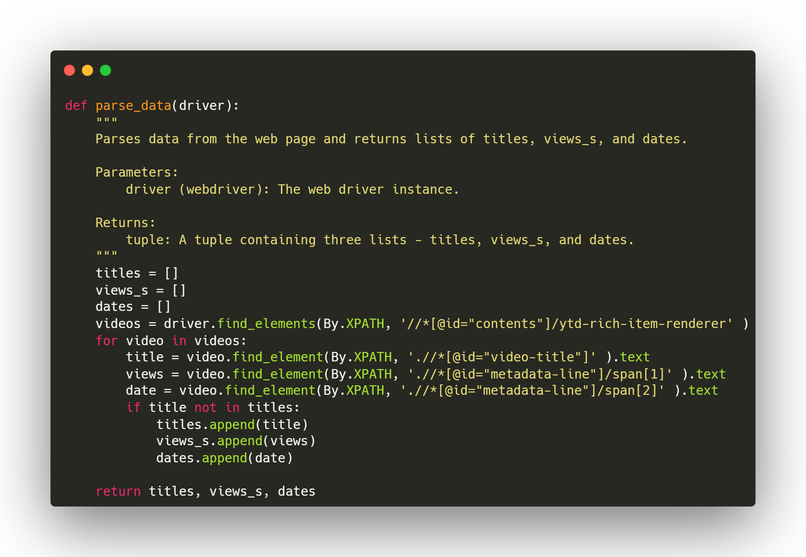
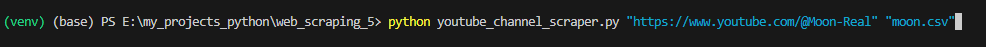

# youtube_channels_scraper

## Project Overview
youtube_channels_scraper is a Python script designed to scrape data from YouTube channels. As YouTube is a heavy Javascript website, this project utilizes __Selenium__, a powerful web automation library, to navigate the website and extract relevant information from the desired channels.

## Features
1. **Web Scraping with Selenium:** The script uses Selenium to interact with the YouTube website, simulating human-like behavior to access the channel pages and gather data.
2. **Browser Selection:** Microsoft Edge is used as the web browser for scraping, providing compatibility with the website's features and ensuring reliable results, but mostly because it is just my default browser.
3. **Filter by Popular Videos:** The script navigates to the videos section of the channel and filters them by popular videos. This allows you to obtain data from the most viewed videos easily.
4. **Infinite Scrolling Handling:** Since YouTube uses infinite scrolling to display videos, this project implements a mechanism to automatically scroll down to the end of the channel's video list, ensuring comprehensive data retrieval.
5. **Data Extraction:** The script extracts crucial information, including video titles, number of views, and dates (e.g., "2 years ago").
6. **Data Export to CSV:** The scraped data is saved to a CSV file using the popular __Pandas__ library, making it easy to analyze and process the data further.

## How to Use
1. Clone the repository or download the script directly.
2. Install the required dependencies using `pip install -r requirements.txt`.
3. Make sure you have __Microsoft Edge__ installed on your system.
4. Or change the script to work with Chrome or any browser you have. 
5. Run the script: `python youtube_channel_scraper.py "<Channel URL>" "<File Name.csv>"`
    - **Channel URL:** Enter the URL of the YouTube channel you want to scrape.
    - **File Name:** Enter the desired file name for the CSV file to save the scraped data. (e.g., `my_scraped_data.csv`)
    - **Example:** `python youtube_channel_scraper.py "https://www.youtube.com/@johnnyharris" "johnny_harris.csv"`.
      
    - **Note:** if you didn't specify a file name, output.csv will be used as the new file name instead.   
6. After providing the inputs, sit back, and let the script handle the scraping process.
7. Once completed, the script will save the data to the specified CSV file in the same directory.
